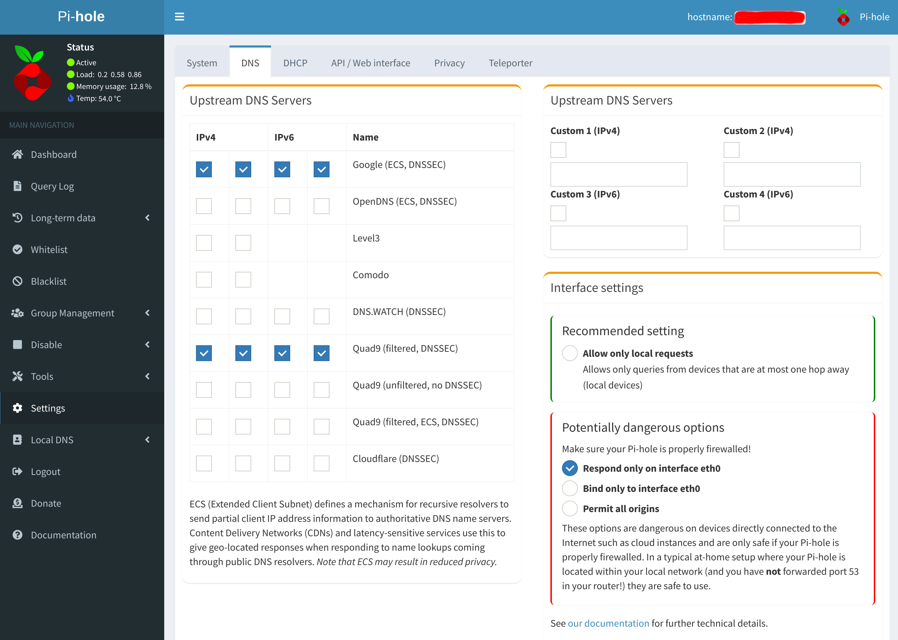

# Pihole

Advertisement and Internet tracker blocking application

## Step 1

Disable systemd-resolved if you are using Ubuntu or a distro that uses systemd-resolved for dns, otherwise skip to step 3

```
sudo systemctl stop systemd-resolved
sudo systemctl disable systemd-resolved
```

## Step 2

Change your dns so you can pull the pihole docker image

```
sudo nano /etc/resolv.conf
```

And change

```
nameserver 127.0.0.53
```

to

```
nameserver 8.8.8.8
```

## Step 3

Run pihole using docker-compose

```
docker-compose up -d
```

## Step 4

Login to your pihole using `http://localhost:8090` with the password `1234` and update pihole upstream dns in `Settings -> DNS` and save the changes



## Step 5

Update your nameserver to pihole

```
sudo nano /etc/resolv.conf
```

And change

```
nameserver 8.8.8.8
```

to

```
nameserver 0.0.0.0
```
